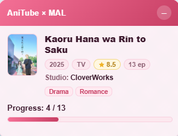
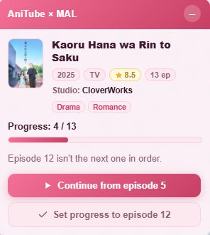
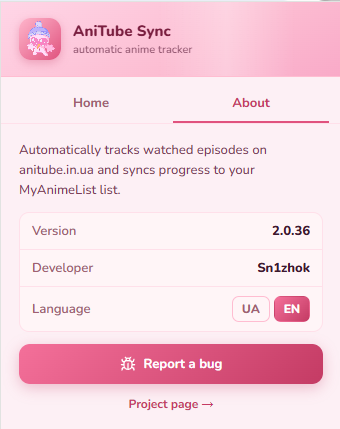

# AniTube → MyAnimeList Sync

[](LICENSE)


🇬🇧 English · [🇺🇦 Українська](README.uk.md)

Browser extension (Chrome/Firefox, Manifest V3) that automatically tracks watched
anime episodes on [anitube.in.ua](https://anitube.in.ua) and syncs your progress to
[MyAnimeList](https://myanimelist.net). Open an anime, press play — your MAL list keeps
itself up to date.

## Features

- **Automatic identification** — reads the anime title from the anitube page and finds
  it on MyAnimeList. If the guess is wrong, a manual search lets you pick the right entry.
- **Automatic progress** — watching the next episode in order writes that episode to your
  MAL list instantly, no clicks required.
- **Smart jump handling** — if you skip across episodes (in either direction), the panel
  asks whether to continue from your MAL position or set the selected episode as your
  progress. Re-watching the previous episode changes nothing.
- **Completion & rating** — on the final episode it offers to rate the anime and mark it
  completed.
- **Rich info card** — poster, year, type, score, studio and genres, with a live progress
  bar. Hover (or click) the poster to enlarge it.
- **Persistent panel** — pinned in the corner, never disappears on its own; collapse it to
  a small floating button and restore it anytime.
- **UA / EN interface** — switch the language right inside the extension; the popup and the
  on-page panel update immediately.

## Screenshots

| Status panel | Episode choice | Popup |
|---|---|---|
|  |  |  |

## How it works

1. **Sign in.** Open the popup and sign in with MyAnimeList (OAuth2 + PKCE). The token is
   stored locally in `chrome.storage`.
2. **Open an anime** on anitube.in.ua. The extension identifies it and shows a confirmation
   card. Confirm it, or use manual search if it picked the wrong title.
3. **A panel appears** in the top-right corner with your current MAL progress. It stays
   there while you watch:
   - **Next episode (N → N+1)** → episode N is marked as watched on MAL automatically.
   - **Jump forward/back by 2+** → the panel asks: *Continue from episode X* (your MAL
     position) or *Set progress to episode Y* (the one you opened). Nothing is written until
     you choose. Handy when you watched a few episodes elsewhere and want to resume.
   - **One step back** → treated as a re-watch; nothing changes.
   - **Final episode** → you're offered a 1–10 rating and the anime is marked completed.
4. **Collapse anytime** with the "–" button — the panel folds into a small button in the
   corner; click it to bring the panel back. Hover the poster to see a larger version.

## Tech & architecture

[WXT](https://wxt.dev) + React + TypeScript, Manifest V3.

| Part | Role |
|---|---|
| Background service worker | Owns OAuth, token storage, and all MAL/Jikan API calls |
| Content script | Injected on anitube; reads the page and renders the panel |
| Popup (React) | Login/logout, about, language switch |

The content script and popup never call external APIs directly — everything is relayed to
the background worker. Anime metadata comes from the [Jikan](https://jikan.moe) API (a public
MyAnimeList API); list reads/writes use the official MAL API v2.

## Development

```bash
npm install
cp .env.example .env   # fill in your MAL app credentials (see below)
npm run dev            # Chrome with HMR
npm run dev:firefox    # Firefox
npm run build          # production build (Chrome)
npm run build:firefox
npm test               # unit tests (Vitest)
npm run compile        # type-check
```

The built extension lands in `.output/chrome-mv3/` — load it via
`chrome://extensions` → "Load unpacked".

### MAL application

MAL credentials are **not** committed — they are injected at build time from `.env`.
Register an app at [MAL API](https://myanimelist.net/apiconfig) and set
`WXT_MAL_CLIENT_ID` and `WXT_MAL_CLIENT_SECRET` in your `.env`. The app's redirect URI must be set to `https://snejn1y.github.io/anitibe_mal_extension/oauth/` (the extension's self-hosted OAuth callback page). The same URI is used by both the Chrome and Firefox builds.
Auth uses OAuth2 + PKCE (MAL requires the client secret for the token exchange).

## Permissions & privacy

- `storage` — keeps your MAL token and settings (language).
- Host access to `anitube.in.ua` (read the page), `myanimelist.net` / `api.myanimelist.net`
  (your list), and the Jikan API (anonymous anime lookups).

The extension talks only to those services. There is no analytics and no third-party server —
your MAL token never leaves your browser except in requests to MyAnimeList itself.

## Reporting bugs

Open an [issue](https://github.com/Snejn1y/anitibe_mal_extension/issues/new) — there is
also a button for it inside the extension (the "About" tab).

## License

[MIT](LICENSE)
