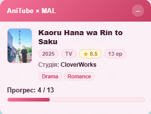
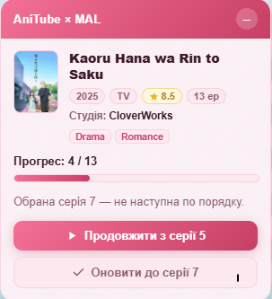
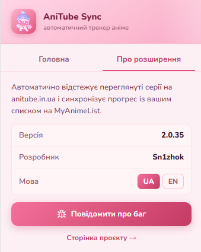

# AniTube → MyAnimeList Sync

[](LICENSE)


[🇬🇧 English](README.md) · 🇺🇦 Українська

Браузерне розширення (Chrome/Firefox, Manifest V3), що автоматично відстежує
переглянуті серії аніме на [anitube.in.ua](https://anitube.in.ua) і синхронізує
прогрес із вашим списком на [MyAnimeList](https://myanimelist.net). Відкрий аніме,
тисни play — список на MAL оновлюється сам.

## Можливості

- **Автоматичне визначення** — зчитує назву аніме зі сторінки anitube і знаходить його на
  MyAnimeList. Якщо вгадало неправильно, є ручний пошук, щоб обрати потрібний запис.
- **Автоматичний прогрес** — перегляд наступної серії по порядку одразу записує її у ваш
  список на MAL, без жодного кліку.
- **Розумна обробка стрибків** — якщо ви перестрибуєте через серії (у будь-який бік), панель
  питає: продовжити з позиції на MAL чи зафіксувати обрану серію як прогрес. Перегляд
  попередньої серії нічого не змінює.
- **Завершення й оцінка** — на фінальній серії пропонує оцінити аніме та позначити завершеним.
- **Інформативна картка** — постер, рік, тип, оцінка, студія та жанри, з живим прогрес-баром.
  Наведи (або клікни) на постер, щоб збільшити його.
- **Постійна панель** — закріплена в кутку, не зникає сама; згортається в маленьку кнопку,
  яку можна розгорнути будь-коли.
- **Інтерфейс UA / EN** — перемикайте мову прямо в розширенні; попап і панель на сторінці
  оновлюються миттєво.

## Скріншоти

| Панель статусу | Вибір серії | Попап |
|---|---|---|
|  |  |  |

## Як це працює

1. **Увійдіть.** Відкрийте попап і увійдіть через MyAnimeList (OAuth2 + PKCE). Токен
   зберігається локально в `chrome.storage`.
2. **Відкрийте аніме** на anitube.in.ua. Розширення визначить його і покаже картку
   підтвердження. Підтвердьте або скористайтесь ручним пошуком, якщо назву вгадано невірно.
3. **Зʼявиться панель** у верхньому правому кутку з вашим поточним прогресом на MAL. Вона
   лишається там, поки ви дивитесь:
   - **Наступна серія (N → N+1)** → серія N автоматично позначається переглянутою на MAL.
   - **Стрибок уперед/назад на 2+** → панель питає: *Продовжити з серії X* (ваша позиція на
     MAL) чи *Оновити до серії Y* (та, яку відкрили). Нічого не записується, доки не оберете.
     Зручно, коли частину серій ви подивились деінде й хочете продовжити.
   - **Один крок назад** → вважається переглядом наново; нічого не змінюється.
   - **Фінальна серія** → пропонується оцінка 1–10, і аніме позначається завершеним.
4. **Згорніть будь-коли** кнопкою «–» — панель складається в маленьку кнопку в кутку;
   клік повертає її. Наведіть на постер, щоб побачити збільшену версію.

## Стек та архітектура

[WXT](https://wxt.dev) + React + TypeScript, Manifest V3.

| Частина | Роль |
|---|---|
| Фоновий service worker | Тримає OAuth, токен і всі виклики API MAL/Jikan |
| Контент-скрипт | Інжектиться на anitube; читає сторінку й малює панель |
| Попап (React) | Вхід/вихід, про розширення, перемикач мови |

Контент-скрипт і попап ніколи не звертаються до зовнішніх API напряму — усе йде через
фоновий worker. Метадані аніме беруться з [Jikan](https://jikan.moe) (публічний API
MyAnimeList); читання/запис списку — через офіційний MAL API v2.

## Розробка

```bash
npm install
cp .env.example .env   # впишіть дані свого MAL-застосунку (див. нижче)
npm run dev            # Chrome з HMR
npm run dev:firefox    # Firefox
npm run build          # продакшн-збірка (Chrome)
npm run build:firefox
npm test               # юніт-тести (Vitest)
npm run compile        # перевірка типів
```

Зібране розширення зʼявиться в `.output/chrome-mv3/` — завантажте його через
`chrome://extensions` → «Завантажити розпакований».

### Свій MAL-застосунок

Ключі MAL **не** зберігаються в репозиторії — вони беруться з `.env` під час збірки.
Зареєструйте застосунок на [MAL API](https://myanimelist.net/apiconfig) і додайте
`WXT_MAL_CLIENT_ID` та `WXT_MAL_CLIENT_SECRET` у `.env`. Redirect URI застосунку має
збігатися з тим, що повертає `chrome.identity.getRedirectURL('provider_cb')` для вашої
збірки. Авторизація — OAuth2 + PKCE (MAL вимагає client secret для обміну токена).

> ⚠️ Зібране розширення містить ці ключі у бандлі — приховати секрет у браузерному
> розширенні неможливо. `.env` лише тримає його поза публічним репозиторієм.

## Дозволи та приватність

- `storage` — зберігає ваш MAL-токен і налаштування (мову).
- `identity` — запускає вхід через MyAnimeList (OAuth).
- Доступ до `anitube.in.ua` (читання сторінки), `myanimelist.net` / `api.myanimelist.net`
  (ваш список) і Jikan API (анонімні запити даних аніме).

Розширення спілкується лише із цими сервісами. Жодної аналітики чи сторонніх серверів —
ваш MAL-токен не залишає браузер, окрім запитів до самого MyAnimeList.

## Повідомити про баг

Створіть [issue](https://github.com/Snejn1y/anitibe_mal_extension/issues/new) — кнопка
для цього є й у самому розширенні (вкладка «Про розширення»).

## Ліцензія

[MIT](LICENSE)
